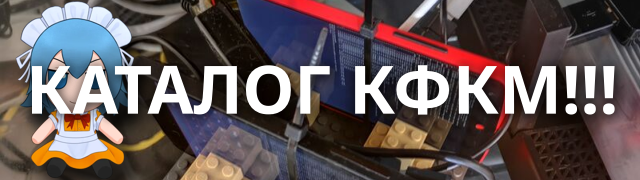

### Что это?

Ну написано же - каталог кфкм. Нужен разбор каждого слова?

**КФКМ** (*определение от DeepSeek*) - это сокращение от **"канал для критики и мемов"** (или аналогичных вариаций). Это Telegram-каналы, где пользователи публикуют:

* **Тейки** — мнения, критика, обсуждения, часто с элементами хейта или сарказма.
* **Мемы и провокационные посты** — например, критика художников, косплееров или других участников комьюнити
* **Щитпосты** — посты, защищающие кого-то или что-то, но часто в агрессивной форме

Аналогия проще - сообщества по интересам.

**Каталог** - систематизированный список или перечень чего-либо, который может содержать описание, характеристики, изображения, и другие данные. Он служит для облегчения поиска и организации информации, товаров, услуг или других объектов.

**Закрепили? Дем дальше?**

### Как поднять у себя?

Вам понадобится:
* Go 1.20+
* MariaDB или MySQL
* Руки, не кривее хуя админа

1. Клонируете репозиторий себе
2. Создаете БД и импортируете `backup.sql`
3. Заполняете `config.toml.example` и переименовываете его в `config.toml`
4. Билдите эту хуйню с помощью команды `go build`
5. Запускаете появившийся исполняемый файл
6. ...
7. PROFIT!

### Примеры работы

[@conf_catalog_bot](https://t.me/conf_catalog_bot)

